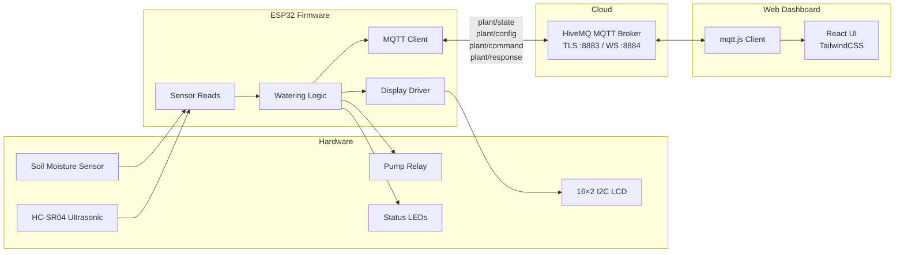

# Automatic Plant Waterer

An end-to-end IoT system that monitors soil moisture and water tank level, automatically waters plants on a configurable schedule, and provides a real-time web dashboard for monitoring and remote control.

## Repository Structure

```
automatic-plant-waterer/
├── firmware/          # ESP32 PlatformIO project
└── plant-waterer-web/ # React web dashboard
```

## Architecture



### Data Flow

1. The ESP32 reads sensors every ~30 seconds and evaluates watering conditions.
2. If soil is dry and the tank has water, the pump relay activates for the configured duration.
3. Sensor state and pump status are published to `plant/state` on the MQTT broker.
4. The web dashboard subscribes to all topics and renders live readings.
5. Users can send `pump:on` / `pump:off` commands from the dashboard; the firmware acknowledges via `plant/response`.
6. Configuration (thresholds, intervals, watering duration) can be pushed to the device over `plant/config`.

## MQTT Topics

| Topic            | Direction    | Description                                       |
| ---------------- | ------------ | ------------------------------------------------- |
| `plant/state`    | Device → Web | Soil moisture %, tank %, pump running, raw ADC    |
| `plant/config`   | Device ↔ Web | Plant configuration (thresholds, intervals, etc.) |
| `plant/command`  | Web → Device | `pump:on` or `pump:off`                           |
| `plant/response` | Device → Web | Command result and optional failure reason        |

## Components

### Firmware (`firmware/`)

- **Platform:** ESP32 (esp32doit-devkit-v1) via PlatformIO + Arduino framework
- **Sensors:** capacitive soil moisture (ADC pin 34), HC-SR04 ultrasonic for tank level (pins 18/19)
- **Outputs:** pump relay (pin 23), 16×2 I2C LCD (SDA 21 / SCL 22), four status LEDs
- **Key libraries:** PubSubClient (MQTT), ArduinoJson, LiquidCrystal_I2C
- **Simulation:** Wokwi support included (`wokwi.toml` + `diagram.json`)

See [`firmware/README.md`](firmware/README.md) for build instructions, pin reference, and configuration details.

### Web Dashboard (`plant-waterer-web/`)

- **Framework:** React 19 + Vite
- **Styling:** TailwindCSS 4
- **MQTT:** mqtt.js 5 over WebSocket (TLS)
- **Features:** live sensor cards, plant health indicator, manual pump control, plant presets, configurable broker URL

See [`plant-waterer-web/README.md`](plant-waterer-web/README.md) for setup and usage instructions.

## Quick Start

### Firmware

```bash
cd firmware

# Edit src/communication/mqtt.cpp with your Wi-Fi and broker credentials

pio run --target upload
pio device monitor
```

### Web Dashboard

```bash
cd plant-waterer-web
npm install
npm run dev
```

Open [http://localhost:5173](http://localhost:5173). Use the Settings modal to point the dashboard at your MQTT broker's WebSocket endpoint.
